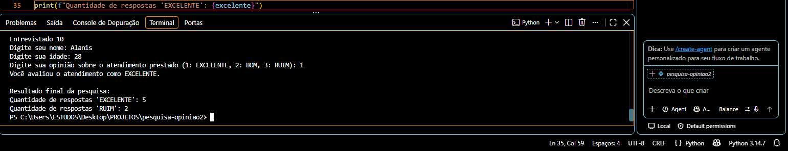

## Programa em Python utilizando a estrutura de repetição para coletar e exibir o retorno de uma pesquisa de atendimento ao cliente com 50 entrevistados.✍
## O programa deve solicitar a digitação do nome, idade e opinião do entrevistado sobre o atendimento prestado, sendo:
- 1: EXCELENTE 🤌
- 2: BOM 👍
- 3: RUIM 👎
- Qualquer outra resposta, o programa retorna como resposta "Opção Inválida" 🤷‍♀️
## Ao final, o programa faz a contagem da quantidade de respostas "Excelente" e "Ruim", exibindo o resultado no terminal.

# Como executar: 💡💡

- Abra o CMD dentro da pasta do programa e execute-o
- Insira o dado solicitado e tecle enter
  
## Prints de teste do programa com 10 entrevistados:

## Tecnologias utilizadas:

